# InterviewAI 🎯

InterviewAI is a cutting-edge web application designed to revolutionize interview preparation. Leveraging advanced AI, it provides job seekers with realistic interview simulations, personalized feedback, and comprehensive analytics to help them ace their next job interview.

## 🚀 Features

*   **AI Video Interview Simulation**: Practice with lifelike AI interviewers that look, sound, and respond like real humans. The greenscreen background has been addressed for a more natural appearance.
*   **Custom Interview Setup**: Configure interviews based on job role, company, experience level, and difficulty.
*   **Dynamic Prompt Generation**: AI-powered backend generates tailored interview questions and conversational contexts for each session.
*   **Stricter AI Feedback Logic**: Receive direct, critical, and actionable feedback designed to pinpoint weaknesses and drive significant improvement. Feedback is adjusted based on interview duration and difficulty level.
*   **Real-time Feedback & Analytics**: Get detailed insights into your performance, including communication, problem-solving, and technical skills.
*   **Conversation Minute Tracking**: Monitor your usage of AI interview minutes, with clear visibility into your subscription plan.
*   **Secure Authentication**: Sign in securely using email/password or OAuth providers (Google, GitHub).
*   **Billing & Subscription Management**: Seamlessly manage your subscription plans and view billing history via Stripe integration.
*   **Responsive Design**: A beautiful and intuitive user interface that works across all devices.

## 📋 Tech Stack

*   **Frontend**: React with TypeScript
*   **Build Tool**: Vite
*   **Styling**: Tailwind CSS
*   **Animation**: Framer Motion
*   **Backend & Database**: Supabase (PostgreSQL, Authentication, Edge Functions, Realtime)
*   **AI Video Interviewers**: Tavus API
*   **Large Language Models (LLM)**: OpenAI (GPT-4) for prompt generation and feedback analysis
*   **Payment Processing**: Stripe

## 🏗️ Project Structure

```
src/
├── components/        # Reusable UI components (auth, layout, dashboard, interview, feedback, ui)
│   ├── auth/          # Authentication forms and providers
│   ├── dashboard/     # Components specific to the dashboard
│   ├── feedback/      # Components for displaying feedback
│   ├── interview/     # Components for the interview session
│   └── layout/        # Navigation and structural components
│   └── ui/            # Shadcn/ui components
├── context/           # React context providers (e.g., AuthContext)
├── data/              # Static data and mock data
├── hooks/             # Custom React hooks (e.g., useAuth, useTavusConversation)
├── lib/               # Utility functions (Supabase client, general helpers)
├── pages/             # Application pages (Landing, Login, Dashboard, Setup, Interview, Feedback, Billing, Settings)
├── services/          # API service functions (InterviewService, ProfileService, StripeService)
├── types/             # TypeScript type definitions
└── vite-env.d.ts      # Vite environment type declarations
supabase/              # Supabase project configuration
├── functions/         # Supabase Edge Functions (Stripe webhooks, Tavus API calls, LLM integrations)
│   ├── _shared/       # Shared utilities for Edge Functions
│   ├── create-tavus-conversation/
│   ├── delete-tavus-persona/
│   ├── end-tavus-conversation/
│   ├── generate-interview-prompts/
│   ├── simulate-feedback/
│   ├── stripe-cancel/
│   ├── stripe-checkout/
│   ├── stripe-portal/
│   ├── stripe-subscription/
│   ├── stripe-webhook/
│   └── tavus-callback/
└── migrations/        # Database schema migrations
```

## ⚙️ Workflow

InterviewAI provides a comprehensive workflow for interview preparation, from user authentication to detailed feedback analysis.

### 1. User Authentication & Onboarding

Users can sign up or log in using email/password or OAuth (Google, GitHub). Supabase handles secure authentication, and a user profile is created or retrieved, including an initial allocation of conversation minutes.

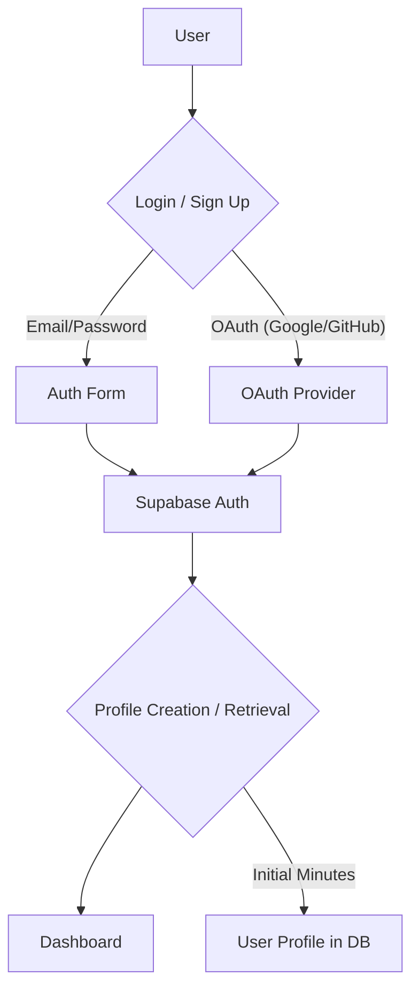

### 2. Dashboard & Interview Management

The dashboard provides an overview of interview activity, remaining conversation minutes, and lists all scheduled, completed, and canceled interviews. Users can manage their interviews, including editing, canceling, or deleting them.

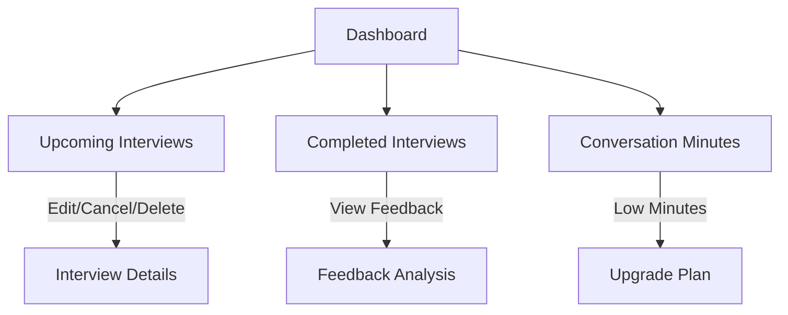

### 3. Interview Setup

Users configure new interview sessions by selecting interview type, job role, company, experience level, difficulty, and duration. The system validates available conversation minutes before creating the interview.

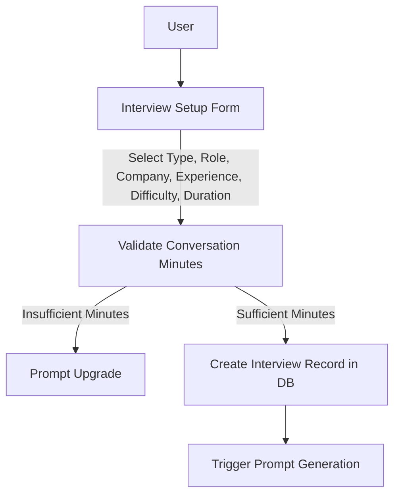

### 4. AI Interviewer Prompt Generation (Backend Integration)

When an interview is created, a Supabase Edge Function (`generate-interview-prompts`) is triggered. This function leverages OpenAI to generate a tailored persona, system prompt, and initial greeting for the AI interviewer. It also creates a Tavus Persona and Conversation (Daily.co room) and updates the interview record. The `apply_greenscreen` property is set to `false` during conversation creation for a more natural background.

```mermaid
sequenceDiagram
    participant Frontend
    participant Supabase_RPC[Supabase RPC]
    participant Edge_Function[generate-interview-prompts Edge Function]
    participant OpenAI[OpenAI API]
    participant Tavus_API[Tavus API]
    participant Supabase_DB[Supabase Database]

    Frontend->>Supabase_RPC: Call createInterview (RPC)
    Supabase_RPC->>Supabase_DB: Insert Interview Record (status: pending)
    Supabase_DB->>Edge_Function: Trigger generate-interview-prompts
    Edge_Function->>Supabase_DB: Check LLM Prompt Cache
    Supabase_DB--Cache Hit-->Edge_Function: Return Cached Prompt
    Edge_Function->>OpenAI: Request Prompt Generation (if no cache)
    OpenAI--Generated Prompts-->Edge_Function: Return Persona, System Prompt, Greeting
    Edge_Function->>Tavus_API: Create Tavus Persona
    Tavus_API--Persona ID-->Edge_Function: Return Persona ID
    Edge_Function->>Tavus_API: Create Tavus Conversation (Daily.co room, apply_greenscreen: false)
    Tavus_API--Conversation URL/ID-->Edge_Function: Return Conversation Details
    Edge_Function->>Supabase_DB: Update Interview Record (status: ready, with Tavus IDs/URLs)
    Edge_Function->>Supabase_DB: Cache Generated Prompt
```

### 5. Interview Session (Video Call)

Users connect to the AI interviewer via a video call. The AI interviewer, powered by Tavus, interacts with the user based on the dynamically generated prompts. The session tracks time, and users can end the call at any point.

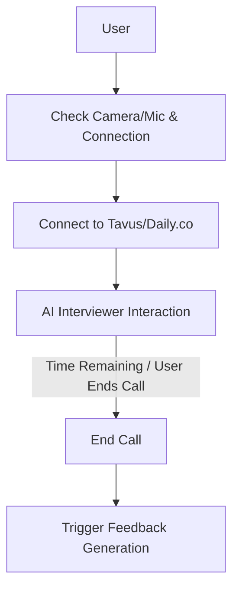

### 6. Feedback Generation (Backend Integration)

Upon interview completion, a Supabase Edge Function (`simulate-feedback`) is triggered. It fetches the conversation transcript and perception analysis from Tavus, then uses OpenAI to generate a comprehensive, critical feedback report. The feedback logic is designed to be stricter, providing more direct and actionable insights, and accounts for interview duration and difficulty level.

```mermaid
sequenceDiagram
    participant Frontend
    participant Supabase_DB[Supabase Database]
    participant Edge_Function[simulate-feedback Edge Function]
    participant Tavus_API[Tavus API]
    participant OpenAI[OpenAI API]

    Frontend->>Supabase_DB: Update Interview Status (processing)
    Supabase_DB->>Edge_Function: Trigger simulate-feedback
    Edge_Function->>Tavus_API: Fetch Conversation Transcript & Analysis
    Tavus_API--Transcript/Analysis-->Edge_Function: Return Data
    Edge_Function->>OpenAI: Request Feedback Generation (with transcript/analysis, stricter logic)
    OpenAI--Generated Feedback-->Edge_Function: Return Scores, Summary, Strengths, Improvements
    Edge_Function->>Supabase_DB: Update Feedback Record
    Edge_Function->>Supabase_DB: Update Interview Status (completed/failed)
```

### 7. Feedback Analysis Display

Users can view a detailed feedback report, including an overall score, summary, strengths, areas for improvement, and a skill-by-skill breakdown. The raw transcript and Tavus AI's perception analysis are also available for deeper insights.

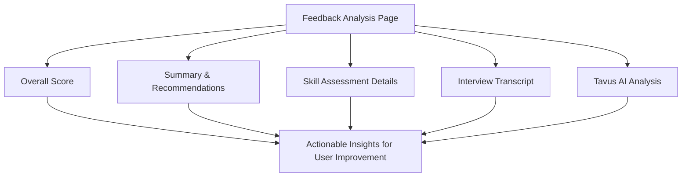

### 8. Billing & Subscription Management (Stripe Integration)

InterviewAI integrates with Stripe for managing subscription plans, processing payments, and tracking conversation minutes. Webhooks ensure the user's profile and minute allocation are always up-to-date.

```mermaid
sequenceDiagram
    participant User
    participant Frontend
    participant Supabase_RPC[Supabase RPC]
    participant Stripe_Checkout[Stripe Checkout]
    participant Stripe_Webhook[Stripe Webhook]
    participant Supabase_Edge_Function[stripe-webhook Edge Function]
    participant Supabase_DB[Supabase Database]

    User->>Frontend: Select Plan / Upgrade
    Frontend->>Supabase_RPC: Call createCheckoutSession
    Supabase_RPC->>Stripe_Checkout: Create Checkout Session
    Stripe_Checkout--Redirect-->User: Payment Page
    User->>Stripe_Checkout: Complete Payment
    Stripe_Checkout->>Stripe_Webhook: Send Event (e.g., checkout.session.completed)
    Stripe_Webhook->>Supabase_Edge_Function: Forward Event
    Supabase_Edge_Function->>Supabase_DB: Update Profile, Subscriptions, Invoices, Minutes
    Supabase_DB--Updated Data-->Frontend: (via polling/realtime)
    User->>Frontend: Manage Billing Portal
    Frontend->>Supabase_RPC: Call createPortalSession
    Supabase_RPC->>Stripe_Checkout: Create Portal Session
    Stripe_Checkout--Redirect-->User: Billing Portal
```

### 9. Settings

Users can update their profile information (name, email) and manage their account security, including changing their password.

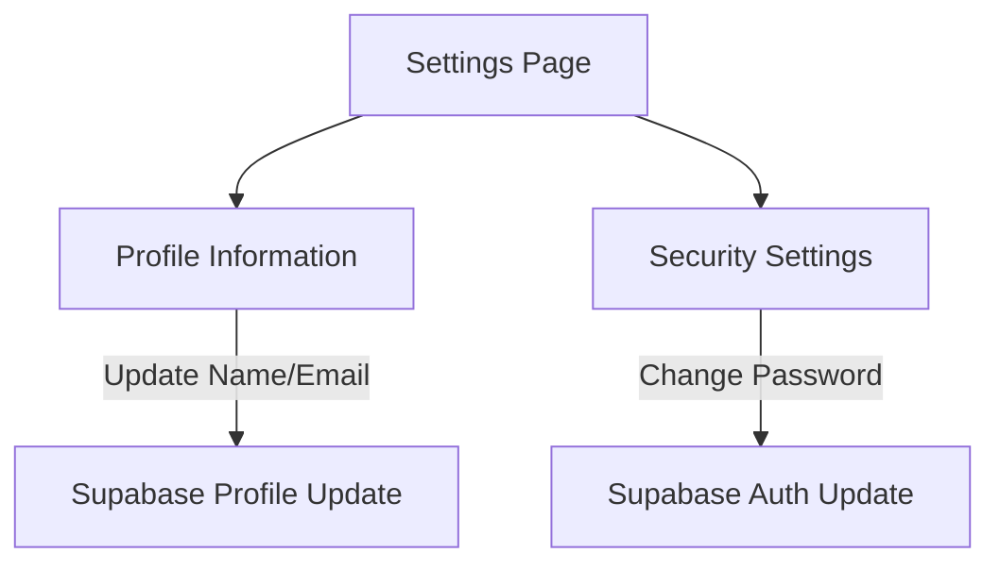

## 🔧 Technical Implementation Details

### Database Schema

The application uses a PostgreSQL database with the following key tables:

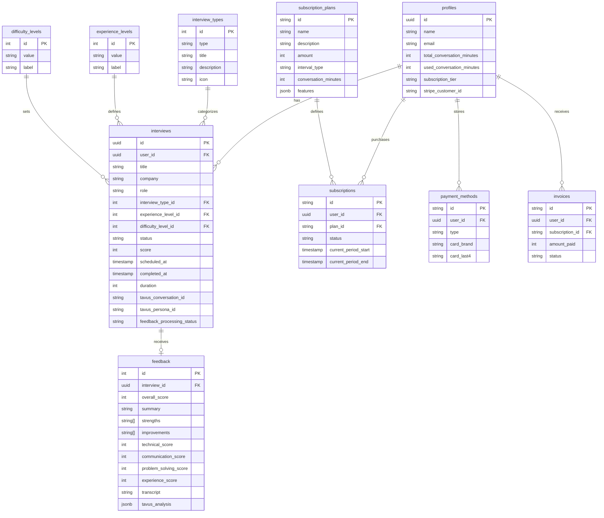

### Authentication Flow

The application uses Supabase Auth for secure authentication:

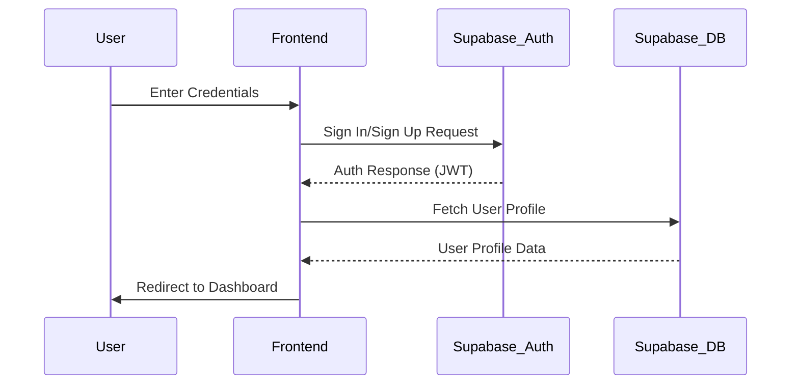

### Interview Creation and Prompt Generation

The application uses a sophisticated prompt generation system:

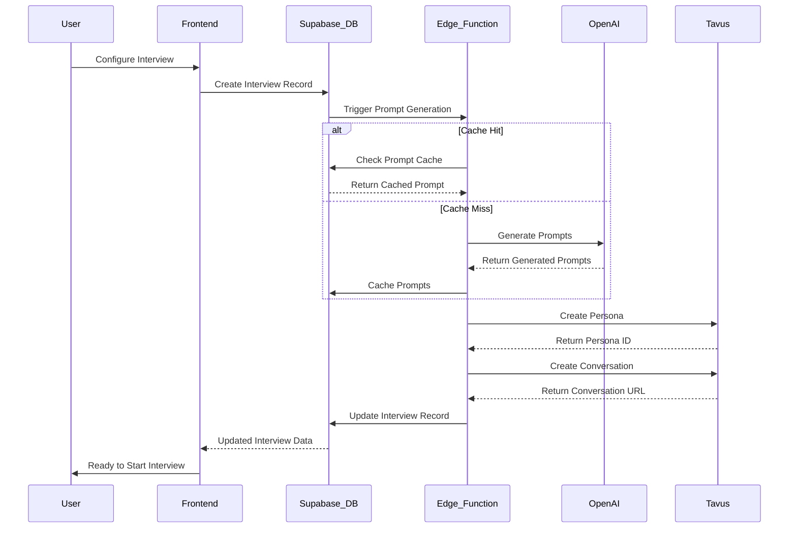

### Video Interview Session

The application integrates with Tavus API and Daily.co for video interviews:

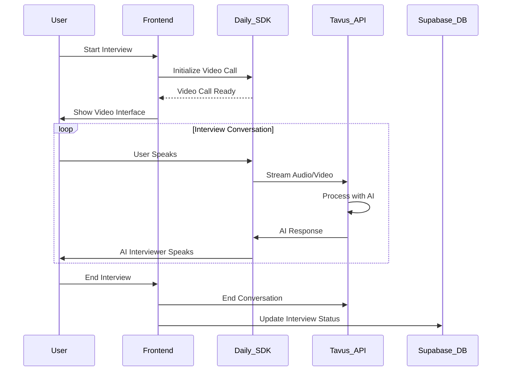

### Feedback Generation Process

The application uses a sophisticated feedback generation system:

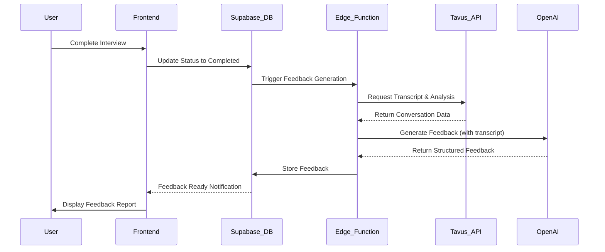

## ⚙️ Setup & Installation

1.  **Clone the repository**

    ```bash
    git clone https://github.com/yourusername/interview-ai.git
    cd interview-ai
    ```

2.  **Install dependencies**

    ```bash
    npm install
    ```

3.  **Set up environment variables**

    Create a `.env` file in the root directory with the following variables. You'll need to obtain keys from Supabase, Tavus, OpenAI, and Stripe.

    ```env
    # Supabase Configuration
    VITE_SUPABASE_URL=your-supabase-url
    VITE_SUPABASE_ANON_KEY=your-supabase-anon-key

    # Tavus API Configuration
    VITE_TAVUS_API_KEY=your_tavus_api_key_here

    # Tavus Replica IDs for Different Interview Rounds (Obtain from Tavus Dashboard)
    VITE_TAVUS_HR_REPLICA_ID=your_hr_replica_id_here
    VITE_TAVUS_TECHNICAL_REPLICA_ID=your_technical_replica_id_here
    VITE_TAVUS_BEHAVIORAL_REPLICA_ID=your_behavioral_replica_id_here

    # Tavus Persona IDs for Different Interview Rounds (Obtain from Tavus Dashboard)
    VITE_TAVUS_HR_PERSONA_ID=your_hr_persona_id_here
    VITE_TAVUS_TECHNICAL_PERSONA_ID=your_technical_persona_id_here
    VITE_TAVUS_BEHAVIORAL_PERSONA_ID=your_behavioral_persona_id_here

    # OpenAI API Configuration
    OPENAI_API_KEY=your_openai_api_key_here

    # Stripe Configuration
    STRIPE_SECRET_KEY=your_stripe_secret_key_here
    STRIPE_WEBHOOK_SECRET=your_stripe_webhook_secret_here
    STRIPE_PUBLISHABLE_KEY=your_stripe_publishable_key_here
    ```

    **Note on Tavus Setup**: For the full experience, you need to create three distinct AI replicas and three personas on Tavus.io, one for each interview type (HR, Technical, Behavioral). Refer to `TAVUS_SETUP_GUIDE.md` for detailed instructions.

4.  **Start the development server**

    ```bash
    npm run dev
    ```

5.  **Set up Supabase**

    - Create a new Supabase project
    - Run the migrations in the `supabase/migrations` directory
    - Deploy the Edge Functions in the `supabase/functions` directory

6.  **Set up Stripe**

    - Create a Stripe account
    - Set up products and prices matching the subscription plans
    - Configure the webhook endpoint to point to your Supabase Edge Function

## 🚀 Deployment

The application is deployed at [https://interviewai.us](https://interviewai.us).

To build for production:

```bash
npm run build
```

This will generate an optimized production build in the `dist` directory.

## 🧪 Testing

The application includes comprehensive testing:

```bash
# Run unit tests
npm run test

# Run end-to-end tests
npm run test:e2e
```

## 🔒 Security Considerations

- **Authentication**: Secure JWT-based authentication via Supabase Auth
- **Data Protection**: Row-level security policies in PostgreSQL
- **API Security**: Edge Functions for secure API calls with service role keys
- **Payment Security**: Stripe handles all payment information, no sensitive data stored
- **Video Security**: Daily.co provides encrypted video sessions

## 🌟 Performance Optimizations

- **LLM Prompt Caching**: Reduces OpenAI API calls for similar interview configurations
- **Lazy Loading**: Components and routes are loaded only when needed
- **Database Indexing**: Strategic indexes for faster query performance
- **Edge Functions**: Serverless functions for scalable backend operations
- **CDN Deployment**: Static assets served via global CDN

## 🔄 CI/CD Pipeline

The project uses GitHub Actions for continuous integration and deployment:

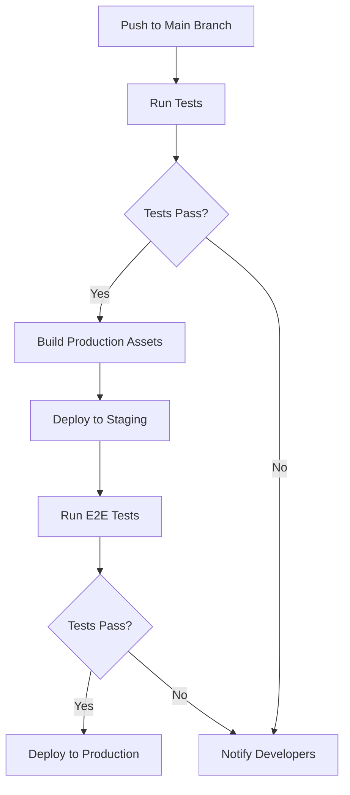

## 🤝 Contributing

We welcome contributions! Please follow these steps:

1.  Fork the repository.
2.  Create a new feature branch (`git checkout -b feature/your-feature-name`).
3.  Commit your changes (`git commit -m 'Add your feature'`).
4.  Push to the branch (`git push origin feature/your-feature-name`).
5.  Open a Pull Request.

## 🐛 Known Issues & Limitations

- Video quality may vary based on user's internet connection
- Some browsers may require additional permissions for camera/microphone access
- Free tier has limited conversation minutes (25 minutes)
- Feedback generation may take up to 5 minutes for longer interviews

## 🔮 Future Roadmap

- **Industry-Specific Templates**: Pre-configured interviews for different industries
- **Interview Recording & Playback**: Allow users to review their own interviews
- **Advanced Analytics Dashboard**: More detailed performance metrics over time
- **Mock Coding Interviews**: Interactive coding challenges during technical interviews
- **Multi-Language Support**: Interviews in languages other than English
- **AI Resume Review**: Automated resume feedback and optimization

## 📄 License

Distributed under the MIT License. See `LICENSE` for more information.

## 📞 Contact

Project Link: [https://interviewai.us](https://interviewai.us)

## 🙏 Acknowledgements

- [Tavus](https://tavus.io) - For the AI video interviewer technology
- [OpenAI](https://openai.com) - For the GPT-4 API
- [Supabase](https://supabase.com) - For the backend infrastructure
- [Stripe](https://stripe.com) - For payment processing
- [Daily.co](https://daily.co) - For video call infrastructure
- [Framer Motion](https://framer.com/motion) - For animations
- [Tailwind CSS](https://tailwindcss.com) - For styling
- [Vite](https://vitejs.dev) - For frontend build tooling